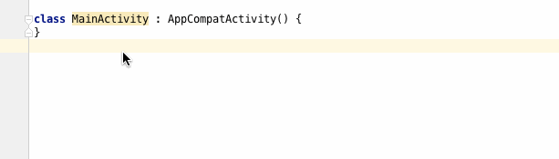

# Activity kreateIntent Inspection

[](http://android-arsenal.com/details/1/3791)

This plugin add an inspection that check if Activity implements following method.

```MainActivity.kt
companion object {
    fun createIntent(context: Context): Intent {
        val intent = Intent(context, LoginActivity::class.java)
        return intent
    }
}
```



This plugin is for developing Android in Kotlin. If you want to have Java version of the inspection, please use [Activity createIntent Inspection](https://plugins.jetbrains.com/plugin/7915)

## Settings

To change settings, go to `Preferences > Editor > Inspections > Android > Activity should implement createIntent (Kotlin)`

### Method name

The method name `createIntent` is configurable.

## Installation

Use the IDE's plugin manager to install the latest version of the plugin.

## License

```
Copyright 2016 Yoshinori Isogai

Licensed under the Apache License, Version 2.0 (the "License");
you may not use this file except in compliance with the License.
You may obtain a copy of the License at

   http://www.apache.org/licenses/LICENSE-2.0

Unless required by applicable law or agreed to in writing, software
distributed under the License is distributed on an "AS IS" BASIS,
WITHOUT WARRANTIES OR CONDITIONS OF ANY KIND, either express or implied.
See the License for the specific language governing permissions and
limitations under the License.
```
